# Wprowadzenie

##  Tło i obszar tematyczny

Praca dotyczy dwóch powiązanych dziedzin teleinformatyki. Pierwszą jest bezprzewodowa komunikacja radiowa dalekiego zasięgu w obszarach pozbawionych infrastruktury sieciowej - czyli tam, gdzie nie ma zasięgu sieci komórkowej ani punktów dostępowych WiFi. Szczególnie interesującą klasą rozwiązań w tym kontekście są sieci radiowe typu mesh, w których każdy węzeł pełni jednocześnie rolę nadajnika, odbiornika i przekaźnika, co eliminuje konieczność istnienia zewnętrznej infrastruktury.

Drugą dziedziną jest tworzenie aplikacji mobilnych integrujących dane z zewnętrznych urządzeń - w tym przypadku urządzeń radiowych - i prezentujących je użytkownikowi w sposób użyteczny w warunkach terenowych. Szczególnym zagadnieniem jest tu geofencing, czyli wykrywanie przekroczenia przez obiekt wirtualnej granicy geograficznej wyłącznie w oparciu o dane lokalizacyjne i obliczenia wykonywane lokalnie na urządzeniu mobilnym.

##  Motywacja

Autor pracy corocznie spędza znaczną część okresu letniego na rodzinnej działce na Mazurach Zachodnich, zabierając ze sobą psa myśliwskiego rasy Mały Gończy Gaskoński o imieniu Reja. Silny instynkt łowczy psa, połączony z otwartą przestrzenią graniczącą z terenami bogatymi w dziką zwierzynę, prowadzi do regularnych ucieczek za zwierzyną. Budowa ogrodzenia nie wchodzi w grę ze względów krajobrazowych i prawnych, a trening odwołania okazuje się niewystarczający - pies pędząc w pogoni przestaje reagować na komendy.

Tak postawiony problem wymaga rozwiązania technicznego: systemu, który umożliwi śledzenia położenia psa w czasie rzeczywistym i alarmowanie właściciela, gdy zwierze oddali się poza bezpieczny obszar. Ograniczeniem jest również brak zasięgu sieci komórkowej na tamtejszych terenach.

## Cel pracy

**Celem pracy inżynierskiej jest zaprojektowanie i implementacja systemu monitorowania położenia zwierząt w czasie rzeczywistym, działającego w obszarach pozbawionych pokrycia sieci komórkowej, wraz z aplikacją mobilną umożliwiającą wizualizację położenia na mapie, definiowanie wirtualnych stref bezpieczeństwa oraz powiadamianie użytkownika o ich przekroczeniu.**

# Sformułowanie problemu i wymagania

Cel pracy możemy sformułować jako rozwiązanie następujących problemów:
1. Problem transmisji danych na duże odległości bez infrastruktury zewnętrznej. Czyli jak zapewnić niezawodną wymianę krótkich pakietów między ruchomymi węzłami w obszarach bez zasięgu sieci komórkowej, przy skromnym budżecie.
2. Problem optymalizacji zajętości pasma, co sprowadza się minimalizacji liczby wysyłanych pakietów. Oznacza to opracowanie metod oszczędzania wysyłki lokalizacji GPS, np. w sytuacjach kiedy węzły są w bezruchu, albo daleko od granicy strefy. Warto zauważyć, że rozwiązanie tego problemu jest również przydatne ze względu na oszczędzanie baterii niewielkich węzłów radiowych.
3. Problem integracji dwóch systemów. Ponieważ interfejs użytkownika znajduje się w smartfonie, konieczne będzie stworzenie integracji aplikacji mobilnej z siecią radiową. 

## Przeznaczenie systemu i charakterystyka użytkownika

System ma służyć do monitorowania położenia psa myśliwskiego w czasie rzeczywistym w obszarach pozbawionych pokrycia sieci komórkowej. Użytkownikiem docelowym jest właściciel psa myśliwskiego przebywający na działce lub w terenie otwartym - osoba niekoniecznie posiadająca wiedzę techniczną z zakresu sieci radiowych czy programowania. Z charakterystyki użytkownika wynikają następujące założenia projektowe:

- interfejs aplikacji mobilnej musi być przejrzysty i niewymagający konfiguracji przy każdym uruchomieniu
- konfiguracja sprzętu radiowego powinna być jednorazowa lub niewymagana oraz nie powinna wymagać interwencji użytkownika w trakcie normalnej eksploatacji
- powiadomienia o przekroczeniu strefy muszą być jednoznaczne i natychmiastowe, również gdy aplikacja jest zminimalizowana albo telefon ma wygaszony ekran.

Opiszę poniżej typowy scenariusz użycia. Właściciel przebywa na działce, pies porusza się swobodnie po terenie. Właściciel uruchamia aplikację, obserwuje pozycję psa na mapie i otrzymuje alarm wibracyjny lub dźwiękowy w momencie, gdy pies oddali się poza zdefiniowaną strefę bezpieczeństwa.

##  Wymagania funkcjonalne

Zdefiniowałem wymagania funkcjonalne z podziałem na fazy projektu:

### Faza 1- Wizualizacja pozycji

System musi odbierać dane o pozycji GPS węzła mobilnego
Aplikacja musi wyświetlać pozycję wszystkich aktywnych węzłów na mapie w czasie rzeczywistym
Aplikacja powinna przechowywać historię pozycji węzłów z bieżącej sesji

### Faza 2 - Geofencing

Użytkownik musi mieć możliwość zdefiniowania strefy bezpieczeństwa w postaci wielokąta na mapie
System musi wykrywać przekroczenie granicy strefy przez węzeł mobilny
Aplikacja musi powiadamiać użytkownika o przekroczeniu strefy również gdy działa w tle
Zdefiniowane strefy muszą być przechowywane między sesjami aplikacji
Użytkownik powinien mieć możliwość definiowania wielu stref jednocześnie

### Faza 3 - Rozszerzenia

System powinien różnicować częstotliwość wysyłania pozycji w zależności od stanu ruchu węzła
Aplikacja powinna umożliwiać przypisanie nazwy i ikony do każdego węzła

## Wymagania parametryczne

Dodatkowo zebrałem wymagania parametryczne opisujące mierzalne cechy części składowych systemu. Opisałem je dodatkowo, żeby wyjaśnić dobór parametrów.

### Parametry sieci radiowej

- Węzły powinny komunikować się na minimalną odległość 2 kilometrów w terenie polnym i częściowo zalesionym, z dostarczalnością pakietów na poziomie minimum 90%. Zadany zasięg pracy wynika z praktyki, która wskazuje, że mniej więcej taka odległość jest wystarczająca do prowadzania poszukiwania psa w wypadku ucieczki/pogoni za zwierzyną.
- Opóźnienie dostarczania pakietów w sieci nie powinno przekraczać 3 sekund. Ta wartość podyktowana jest koniecznością reakcji w przypadku opuszczenia strefy przez psa. Zbyt duże opóźnienie mogłoby spowodować utratę cennego czasu reakcji.

### Parametry węzła mobilnego (obroża)

- Węzeł mobily powinien być możliwie mały i lekki, aby zapewnić możliwość przymocowania do obroży średniej wielkości psa. (ok. 20 kg)
- Powinien być odporny na warukni atmosferyczne, zachlapania wodą oraz uszkodzenia mechaniczne.

### Parametry aplikacji mobilnej
- Aplikacja powinna działać na platformie Android 8.0 lub nowszym
- Aplikacja musi mieć możliwość działania w tle
-

## Przegląd istniejących rozwiązań
Środowisko myśliwskie zna wiele rozwiązań na utrzymywanie psów w ściśle zdefiniowanych obszarach. Rozważając jedynie elektroniczne rozwiązania przedstawię tutaj jedynie te najlepiej dopracowane. 

### Dogtra Pathfinder 2
Jest to jeden z najbardziej zaawansowanych produktów z tej dziedziny. Zestaw składa się z odbiornika, który łączy się z telefonem przez bluetooth, oraz jednego lub więcej (maksymalnie 21) nadajników, które są umieszczone na obrożach elektronicznych. Urządzenia łączą się ze sobą po falach radiowych. (Nie udało mi się uzyskać bardziej szczegółowych informacji). Odbiornik zarówno przekazuje dane z nadajników, ale też daje możliwość użycia przycisku. Może on być zaprogarmowany do wzbudzania impulsów elektrycznych w obroży, emitowania światła, dźwięku albo wibracji w nadajnikach. Dodatkowo aplikacja PATHFINDER2 app, która łączy się przez Bluetooth z odbiornikiem służy do wyświetlania dokładnej pozycji wszystkich skonfigurowanych nadajników, podglądania ich stanu ( ikony psów zmieniają się w zaleźności od ich aktualnego zajęcia np. szczekanie, wskazywanie zwierzyny, przycinanie drzew, bieganie, czy nawet osaczanie "wieprza" ), naładowania baterii nadajników, aż do statusu połączenia z GPS. Pozatym aplikacja umożliwia nagrywanie lokalizacji w sesje do późniejszego odtworzenia, nawigację na Mapach Google, pomiary odległości, sterowanie modułami na nadajnikach (wibracja, dźwięk, światło, impul elektryczny). 
Ciekawą funkcją jest możliwość definiowania różnego rodzaju "E-Ogrodzeń". Firma Dogtra opracawało trzy rodzaje ogrodzeń:
   1. Mobile-Fence: Ogrodzenie, które porusza się w oparciu o lokalizację smartfona i wysyła powiadomienia. 
   2. Geo-Fence: Konfiguracja statycznego ogrodzenia, które wysyła powiadomienia. 
   3. E-Fence: Statyczna konfiguracja ogrodzenia, która wysyła psu automatyczną korektę i powiadomienie.
   " chrome-extension://efaidnbmnnnibpcajpcglclefindmkaj/https://i00.eu/file/403/15309-manualplpathfinder2.pdf strona 26
   
Producent deklaruje następujące parametry pracy:
- zasięg do 9 mil (14,484 m)
- aktualizajce pozycji co 2 sekundy
- wagę nadajnika 
- użytkowania bez dodatkowych opłat za abonamenty

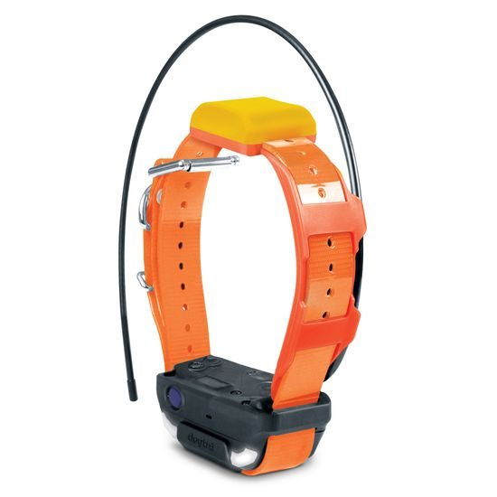
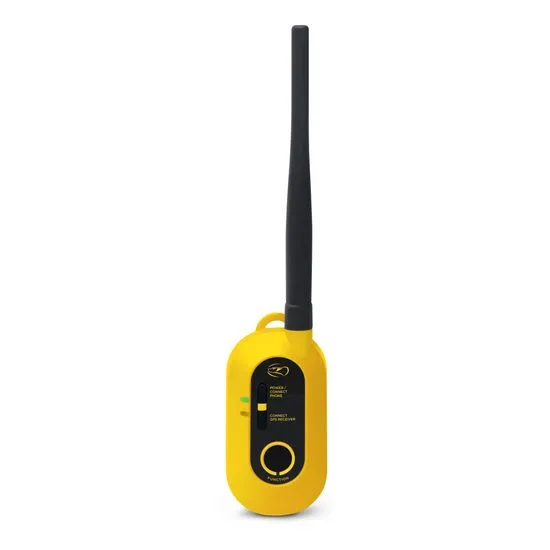

### Dogtrace DOG GPS X25
Jedynie nieznacznie różnym podejściem wykazała się firma DOGTRACE, która w swoim rozwiązaniu zdecydowała się zrezygnować z konieczności użycia smartfona. X25 składa się z identycznego funkjonalnie nadajnika oraz znacznie rozbudowanego odbiornika, wielkości mniejszego smartfona, który na wbudowanym wyświetlaczu LCD pokazuje kierunek i odległość do nadajnika. Czeska firma udostępniła lepszej jakości informację o funkcjonowaniu swojego produktu. Juz samej oferty na stronie internetowej dowiadujemy się, że:
- Mamy możlowość śledzenia do 19 psów 
- Bateria nadajnika i odbiornika powinna wystarczyć na ponad 40 godzin pracy (Li-Pol 1900 mAh)
- Pozycjonowanie modułów zapewnia skorzystanie z kilku systemów: GPS, GALILEO, GLONASS, a nadajnik z odbiornikiem łączą sie po LoRa.
- Deklarowany zasięg to 20 km dla komunikacji "w lini wzroku"
- Pełna zanurzalność nadajnika i odbiornika
-  Dodatkowo dostępne są funkcje takie jak :

    - KOMPAS - kierunek na północ magnetyczną
    - BEEPER - wykrywanie ruchu lub bezruchu psa
    - FENCE - okrągły płot - akustyczna granica wyznaczająca przestrzeń dla psa
    - WAYPOINT - możliwość zapisania 4 współrzędnych gps odbiornika - nawigacja do tych punktów
    - CAR mode - tryb umożliwiający korzystanie z odbiornika (urządzenia ręcznego) w pojeździe
    - Sygnał dźwiękowy - zastępuje gwizdek, do wyboru 3 różne dźwięki """ cytat z https://www.obroza-elektryczna.pl/dogtrace-dog-gps-x25

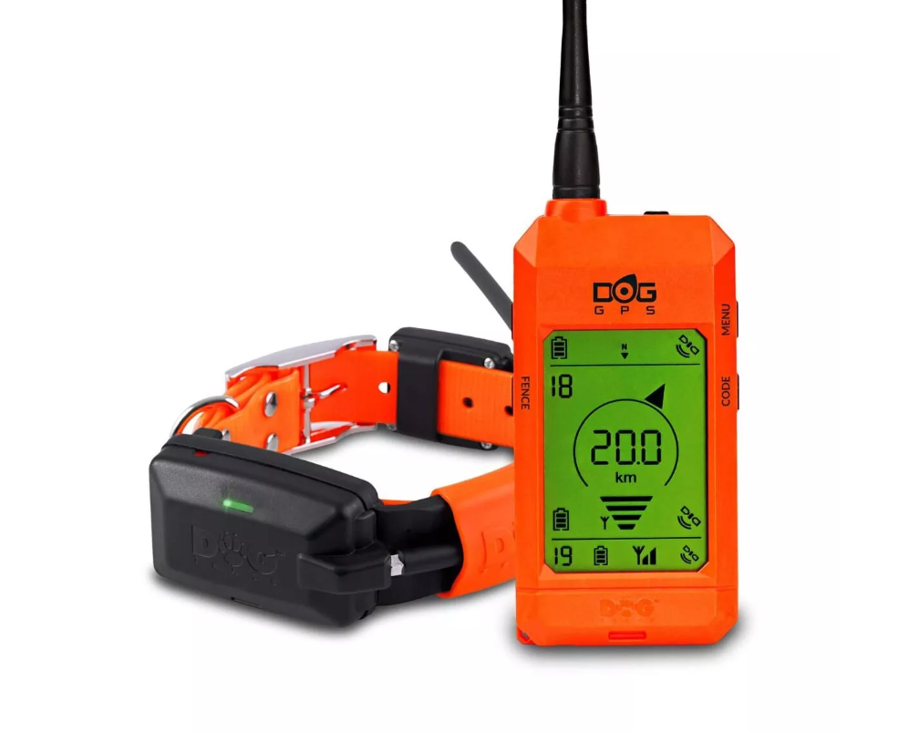

# Projekt  

## Wybór technologii

Dobór platformy sprzętowej rozpocząłem od zdecydowania się na korzystanie z techniki modulacji LoRa. Poniżej przedstawiam, krótki opis teoretyczny oraz uzasadnienie wyboru.

### Modulacja LoRa i technika Chirp Spread Spectrum

LoRa (ang. *Long Range*) to technika modulacji radiowej, która pozwala na przesyłanie niewielkich pakietów danych na bardzo duże odległości – nawet kilkanaście kilometrów – przy minimalnym zużyciu energii [https://www.gov.pl/web/instytut-lacznosci/lora-pod-lupa]. Jej zamysł opiera się na technice modulacji CSS (ang. *Chirp Spread Spectrum*) lub FSCM (ang. *Frequency Shift Chirp Modulation*) [L. Vangelista, "Frequency Shift Chirp Modulation: The LoRa Modulation" in IEEE Signal Processing Letters vol. 24, no. 12, pp. 1818-1812, Dec. 2017, doi: 10.1109/LSP.2017.2762960]. Polega ona na kodowaniu sygnału przez cykliczne przesunięcie punktu starowego chirpa. Wspomniany chirp to "blok" sygnału o liniowo zmiennej częstotliwości. 

Modulację LoRa opisują trzy główne parametry:

- **Współczynnik rozpraszania SF** (ang. *Spreading Factor*) określa liczbę chirpów przypadających na jeden symbol. Im wyższy SF, tym dłuższy czas transmisji symbolu, ale też lepsza **czułość odbiornika** i **większy zasięg**. W praktyce stosuje się wartości od 7 do 12.

- **Szerokość pasma BW** (ang. *Bandwidth* ) określa zakres częstotliwości zajmowany przez sygnał. Szersza szerokość pasma oznacza krótszy czas transmisji symbolu przy tym samym SF, ale też wyższy poziom szumów i mniejszy zasięg. W praktyce do wyboru są częstotliwości 125, 250 lub 500 kHz.

- **Współczynnik kodowania CR** (ang. *Coding Rate*) określa nadmiarowość kodu korekcji błędów. Wyższy CR zwiększa odporność na błędy transmisji kosztem wydajności.

Przepustowość bitową modulacji LoRa wyraża wzór:

$$R_b = SF \cdot \frac{BW}{2^{SF}} \cdot \frac{CR}{4+CR}$$
[https://josefmtd.com/2018/08/14/spreading-factor-bandwidth-coding-rate-and-bit-rate-in-lora-english/]

Kluczową zaletą CSS jest odporność na zakłócenia wąskopasmowe poprzez rozłożenie energii sygnału na całe dostępne pasmo. Efekt Dopplera (istotny przy komunikacji w ruchu) również jest organiczony. Wynika to z tego, że odczyt symbolu polega w skrócie na mnożeniu odebranego sygnału przez chirp bazowy i robieniu FFT (ang. *Fast Fourier Transform*). Powstały w wyniku pik widmowy, jest "jedynie" przesunięty i przy prędkościach spotykanych w praktyce nie spowoduje błędu dekodowania. 

Zawyczaj do konfiguracji sieci Meshtastic używa się następujących parametrów: SF=12, BW=125 kHz oraz CR=4/8. Podstawiając do wzoru osiągamy przepustowość na poziomie 250 bps. Jest ona w zupełności wystarczająca do przesyłania krótkich pakietów zawierających współrzędne GPS.

### Wybór platformy sprzętowej

Rozważyłem możliwość wykorzystania różnych platform sprzętowych z modułami radiowymi LoRa. Oto lista wziętych pod uwagę:

1. **Raspberry Pi z modułami LoRa** - mimo licznych zalet, w których zawiera się  m.in. bogate wsparcie, względnie wysoka moc obliczeniowa, oraz elastyczność, przeważyły wady, które wykluczyły to rozwiązanie. Zbyt duże zużycie energii, duże rozmiary, brak wodoszczelności. Podobne argumenty zdecydowały o wyeliminowaniu również: *Arduino Uno/Nano z modułem LoRa* 
2. **ESP32 z modułami LoRa** - w szczególności roważałem *Heltec ESP32 LoRa*, czyli płytkę z wbudowanym modułem LoRa i wyświetlaczem OLED. Produkt ten, posiada dużo cech wypełniających wymagania projektu, tj. wbudowany moduły Bluetooth i LoRa , cechuje się niskim zużyciem energi i niskim kosztem, jednak nie ma dostępnych obdudów z zadowalającą wodoszczelnością i odpornością na uszkodzenia mechaniczne.

Prowadząc badanie rynku modułów wykorzystujących LoRa do komunikacji natknąłem się na platformę Meshtastic. Jest to projekt OpenSource, który łączy firmware dla modułów radiowych LoRa z ekosystemem aplikacji klienckich, tworząc tym sposobem zdecentralizowaną sieć mesh działającą w paśmie ISM bez konieczności jakiejkolwiek infrastruktury zewnętrznej. Każdy węzeł sieci automatycznie retransmituje pakiety innych węzłów, rozszerzając zasięg sieci wraz z liczbą urządzeń. Dodatkowo projekt udostępnia publiczne API w postaci aplikacji Android com.geeksville.mesh, eksportującej interfejs AIDL umożliwiający aplikacjom trzecim odczyt danych telemetrycznych - w tym pozycji GPS węzłów. Sprzęt kompatybilny z Meshtastic jest ogólnodostępny i tani, a samo oprogramowanie bezpłatne. Wybór padł na:
- *T-Beam* - popularna platforma oparta na ESP32 z wbudowanym modułem GPS, anteną LoRa oraz akumulatorem. Posiada duży akumulator oraz otwarte PINy, które zostawiają szerokie pole manewru do rozwoju tego węzła w roli stacji bazowej. [zdjęcie T-Beam]
- *T-2000-E* - kompaktowe urządzenie, oferujące wodoszczelność (IP67), wbudowany GPS oraz zoptymalizowaną żywotność baterii. Wymiary i kształt są najodpowiedniesze do umieszczenia na obroży. [zdjęcie T-2000-E]

Otwartoźródłowy charakter projektu stwarza również możliwość implementacji rozszerzeń dla węzłów sieci w postaci modułów [https://meshtastic.org/docs/development/firmware/build/]. Dzięki temu wybór Meshtastic jako platformy sprzętowej nie ograniczy projektu do domyślnie dostępnych funkcji. Dodatkowo sporód dostępnych konfiguracji radiowych możemy wybrać parametry dla modulacji LoRa. Są one zestawione w formie ustawień dla poszczególnych kanałów :

| Ustawienie | Szerokość pasma BW [kHz] | Współczynnik rozpraszania SF |Współczynnik kodowania CR |
|---|---|---|---|
| ShortTurbo | 500 | 7 | 4/5 | 
| ShortFast | 250 | 7 | 4/5 | 
| ShortSlow | 250 | 8 | 4/5 | 
| MediumFast | 250 | 9 | 4/5 |
| MediumSlow | 250 | 10 | 4/5 | 
| LongFast | 125 | 11 | 4/5 | 
| LongModerate | 125 | 11 | 4/8 |
| LongSlow | 125 | 12 | 4/8 |
[źródło https://meshtastic.org/docs/software/site-planner/]

Zwiększa to elastyczność projektu pod względem testów zajętości pasma w technice LoRa.

### Konfiguracja sieci Meshtastic

Skonfigurowałem sieć Meshtastic, aby wszystkie węzły mogły przesyłać między sobą informacje o swoim położeniu GPS.

#### Jak Działa Przesyłanie Pozycji w Meshtastic

W sieci Meshtastic, informacje o pozycji GPS są przesyłane jako część telemetrii węzła. Telemetria jest automatycznie udostępniana wszystkim węzłom w sieci, które:
- *Używają tego samego kanału PRIMARY* (lub kanału wtórnego z włączoną pozycją) oraz *mają zgodne ustawienia LoRa* (częstotliwość, modem preset) oraz *są w zasięgu* (bezpośrednio lub przez pośrednie węzły)

[schemat sieci Meshtastic]

#### Konfiguracja - Prywatne Kanały

Ponieważ chciałem udostępniać pozycję tylko wybranym węzłom (tylko w mojej sieci), musiałem użyć *prywatnego kanału*.

1. **Wyłączyłem pozycję na kanale PRIMARY**:
   - Settings → Radio Config → Channels → Channel 0 (PRIMARY)
   - Position Sharing: **WYŁĄCZONE**

2. **Utworzyłem prywatny kanał**:
   - Settings → Radio Config → Channels → **Add Channel**
   - **Channel Name**: `Reja`
   - **PSK**: Ustawiłem **wspólny klucz szyfrowania** 
   - **Position Sharing**: **WŁĄCZONE**
   - **Position Precision**: Wybrałem największy poziom precyzji 32-bity. (Deklaruje dokładność co do metra)

3. **Dodałem ten sam kanał do wszystkich węzłów w grupie**:
   - Wszystkie węzły mają identyczną nazwę kanału `Reja` oraz *identyczny klucz PSK*

// TODO:  Dodać ustęp o rolach w MEshtastic

## Aplikacja mobilna MeshTracker

### Architektura 

Aplikacja wykorzystuje architekturę opartą na wzorcu **MVVM (Model-View-ViewModel)** z osobnymi, dodatkowymi warstwami odpowiedzialnymi za komunikację zewnętrzną z aplikacją Meshtastic. Jest to standardowo wykorzystywany wzorzec, który oddziela logikę działania aplikacji od interfejsu użytkownika [https://learn.microsoft.com/pl-pl/dotnet/architecture/maui/mvvm]

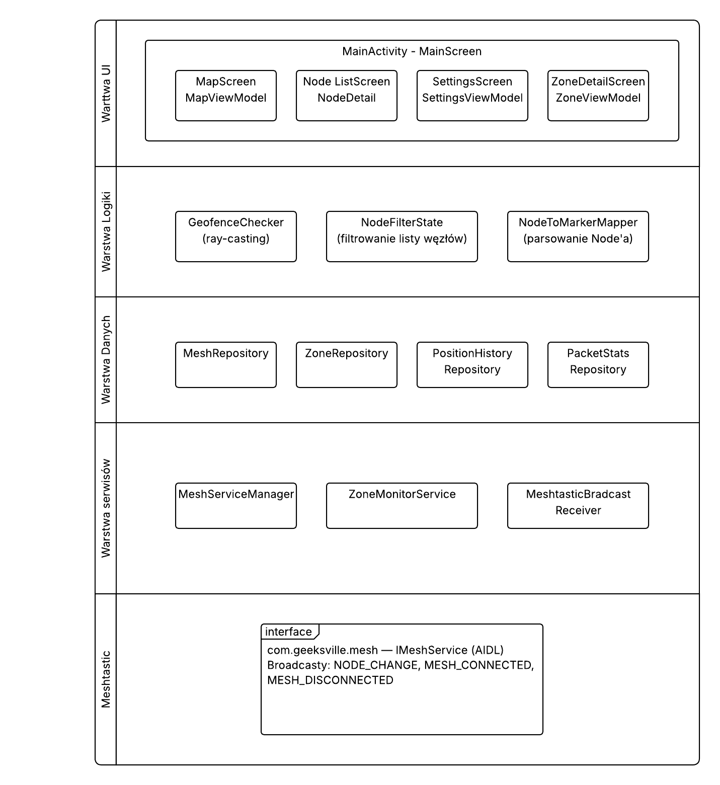

### Przegląd ekranów aplikacji

Interfest użytkownika znajduje się w folderze `ui`, a jego struktura przedstawia się następująco:

ui/
├── MainScreen.kt
├── components/
│   └── ConnectionStatusBar.kt
├── map/
│   ├── MapScreen.kt
│   └── MapViewModel.kt
├── nodes/
│   ├── NodeDetailScreen.kt
│   ├── NodeFilterState.kt
│   ├── NodeItem.kt
│   └── NodeListScreen.kt
├── settings/
│   ├── SettingsScreen.kt
│   └── SettingsViewModel.kt
├── theme/
│   ├── Color.ktMa
│   ├── Theme.kt
│   └── Type.kt
└── zones/
    ├── ZoneBottomSheet.kt
    ├── ZoneConfirmDialog.kt
    ├── ZoneDetailScreen.kt
    └── ZoneViewModel.kt
   

#### Mapy

MapScreen jest głównym ekranem aplikacji. Zawiera Google Maps, na której świetlają się markery węzłów oraz pozycja użytkownika. Każdy marker renderowany jest jako bitmapa z inicjałami węzła. Kolor markera zależy od jego roli (więcej o rolach węzłów w rozdziale "Konfiguracja Meshtastic") i stanu połącznia. Dodatkowo w prawym górnym rogu markera znajduje się znacznik jakości sygnału. W lewym dolnym rogu znajduje się "floating button", który otwiera menu geofencingu.

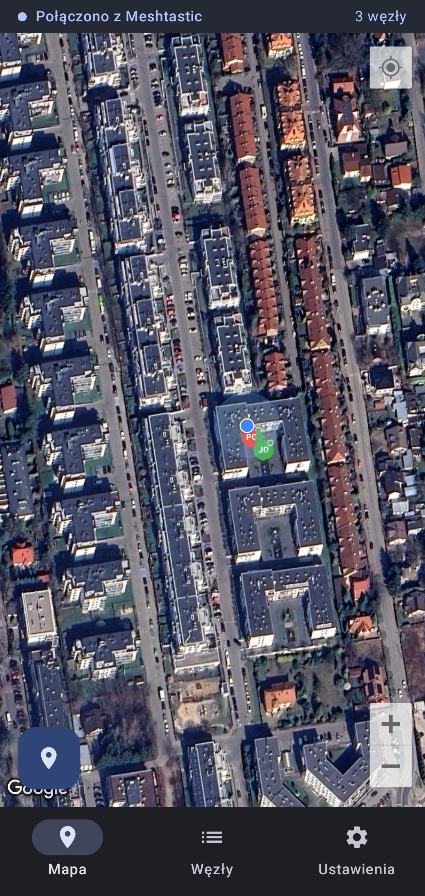

#### Markery

Wizualizacja markerów została zaprojektowana w taki sposób, żeby w jak najbardziej przeżysty sposób zaprezentować możliwie jak najwięcej danych. Kolor markera odpowiada przypisanej mu roli:

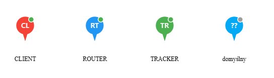

Stan połączenia do sieci Meshtastic reprazentuje dodatkowa warstwa kolorów. 

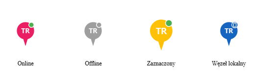

Węzeł lokalny, czyli ten połączony z telefonem użytkownika bezpośrednio przez Bluetooth, ma małą ikonkę telefonu w prawym górnym rogu. Pozostałe węzły mają w tym miejscu kropkę, której kolor odpowiada jakości połączenia z siecią. Został on dobrany w taki sposób, żeby reprezentował zakres SNR (*Signal-to-Noise Ratio* - stosunek mocy użytecznego sygnału do mocy szumu [dB]).

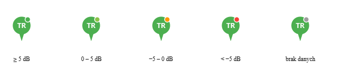

Strzałka odpowiada kierunkowi poruszania się węzła w przestrzeni.

#### Geofencing

Menu stref dostępne jest pod przyciskiem "floating button" w lewym dolnym rogu. Po jego otwarcu użytkownik może w prosty sposób stworzyć strefę i przypisać do niej monitorowane węzły.

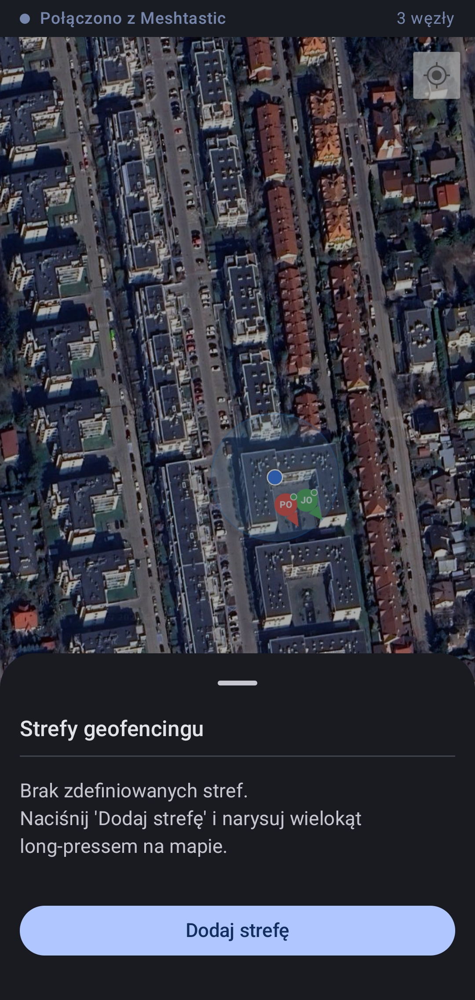

Strefy składają się z wielokątów, których wierzchołki tworzone są poprzez "długie przyciśnięcie" punktu na mapie. Po dodaniu trzecieg punktu na mapie ukazuje się opcja "Zamknij", która stworzy strefę geofencingu z wprowadzonych punktów na mapie.

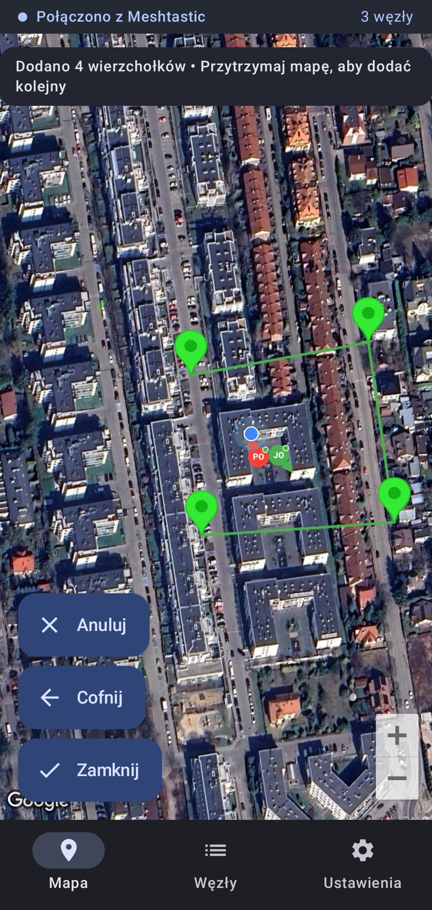

Natępnie użytkownik wprowadza nazwę strefy, nadaje jej kolor oraz przypisuje węzły, które będą triggerować zdarzenia wejścia i wyjścia z danej strefy.

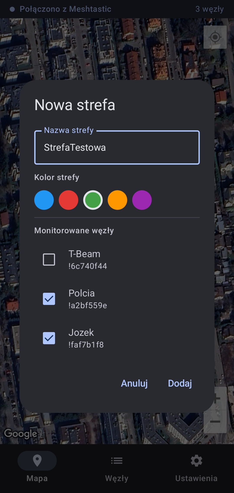

Dostępne strefy mogą być aktywowane i usuwane z poziomu listy.

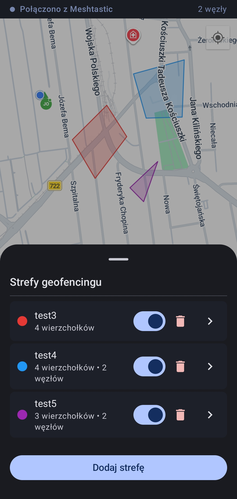

### Integracja z aplikacją Meshtastic

Aplikacja MeshTracker nie komunikuje się bezpośrednio z urządzeniami radiowymi — korzysta z aplikacji Meshtastic zainstalowanej na tym samym telefonie, która pełni rolę pośrednika między sprzętem a aplikacjami trzecimi. Meshtastic eksponuje dwa mechanizmy IPC (ang. *Inter-Process Communication*): interfejs AIDL (ang. *Android Interface Definition Language*) umożliwiający bezpośrednie wywołania metod na działającym serwisie, oraz broadcasty Androida rozsyłane do wszystkich zainteresowanych aplikacji przy każdej zmianie stanu sieci. MeshTracker korzysta z obu jednocześnie, co zapewnia zarówno możliwość pobrania bieżącego stanu sieci na żądanie, jak i reaktywne powiadamianie o nowych danych bez konieczności aktywnego odpytywania.

//TODO: Schamat nawiązywania połączenia 

Po uruchomieniu aplikacji `MapViewModel` inicjuje połączenie przez `MeshRepository.connect()`. `MeshServiceManager` wywołuje `bindService()` z akcją `com.geeksville.mesh.service.MeshService`, co powoduje powiązanie z działającym serwisem Meshtastic. Równolegle rejestrowany jest `MeshtasticBroadcastReceiver` nasłuchujący na trzy akcje: `com.geeksville.mesh.NODE_CHANGE` (aktualizacja węzła), `com.geeksville.mesh.MESH_CONNECTED` oraz `com.geeksville.mesh.MESH_DISCONNECTED`. Gdy połączenie zostanie nawiązane, ViewModel pobiera bieżącą listę węzłów przez AIDL i uruchamia cykliczne odświeżanie w odstępach konfigurowanych przez użytkownika. Każdy odebrany broadcast z kolei aktualizuje stan w czasie rzeczywistym bez oczekiwania na kolejny cykl odświeżania.